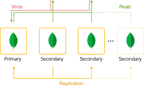

## MongoDB Replica Set Cluster

The JPS package deploys MongoDB Replica Set cluster that initially contains 3 replica set member nodes. It provides the solution for solving performance problems, DB backups support, gives ability to alleviate system failures. 

### Highlights
This package is designed to solve a number of different problems with performance, the primary database downtime (e.g. due to hardware failure or connection interruption).
It enables data replication from one database server (the Primary) to another  cluster members (the Secondaries).
The primary database will process all the incoming write operations, storing the information about them within its oplog, where they can be accessed and replicated by every secondary replica member for being applied to their data sets. In such a way, all of the servers will represent the same content and ensure its availability.  
Normally the read operations are handled by primary server as well, but if necessary the workload can be distributed among all cluster members. To get more information regarding MongoDB Replica Set installation specifics  see our blog post [MongoDB Replica Set Auto-Сlustering for High Availability and Performance](https://jelastic.com/blog/mongodb-auto-clustering/).
 

### Environment Topology

 

### Deployment

In order to get this solution instantly deployed, click the "Deploy" button bellow, specify your email address within the widget, choose one of the [Virtuozzo Public Cloud Providers](https://www.virtuozzo.com/application-platform-partners/) and press Install.

To deploy this package to Jelastic Private Cloud, import [this JPS manifest](manifest.yaml) within your dashboard ([detailed instruction](https://docs.jelastic.com/environment-import)).

